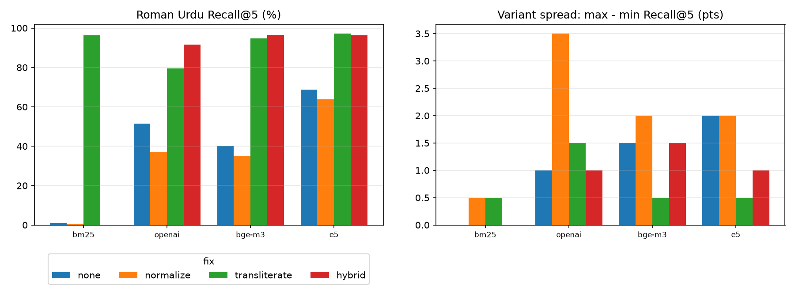

# roman-urdu-retrieval

A Roman Urdu retrieval benchmark: how much does it hurt semantic search and RAG when someone types an Urdu question in Latin letters (and spells it however they like) instead of Urdu script. We measure BM25, bge-m3, multilingual-e5-large-instruct and OpenAI text-embedding-3-large on 200 test questions, then test three fixes. The short version: the drop is large, spelling variation is a smaller problem than script, and transliterating the query to Urdu script before searching fixes most of it.



## Results

200 test questions, each asked in Urdu script, in English and in three Roman Urdu spellings of the same sentence. The pool is 3,674 Wikipedia passages (1,674 Urdu, 2,000 English). The right answer is always one Urdu passage. Recall@5 is the share of questions where that passage is in the top 5. Everything comes from `run_benchmark.py` (see `results_table.md` and `results.json`).

| Retriever | Urdu script | English | Roman Urdu (mean of 3 spellings) | Drop, Urdu to Roman | Questions where the 3 spellings disagree |
| --- | --- | --- | --- | --- | --- |
| BM25 | 98.5% | 1.0% | 1.0% | 97.5 pts | 0.0% |
| OpenAI text-embedding-3-large | 84.0% | 45.5% | 51.5% | 32.5 pts | 14.5% |
| bge-m3 | 99.0% | 80.5% | 40.0% | 59.0 pts | 9.0% |
| multilingual-e5-large-instruct | 98.0% | 16.5% | 68.8% | 29.2 pts | 12.5% |

Roman Urdu Recall@5 after each fix (same 200 questions, mean of the 3 spellings, 95% bootstrap interval over questions in brackets):

| Retriever | No fix | Spelling rules | LLM transliteration | Hybrid |
| --- | --- | --- | --- | --- |
| BM25 | 1.0% [0.0, 2.5] | 0.7% [0.0, 1.8] | 96.3% [93.7, 98.5] | n/a |
| OpenAI | 51.5% [45.3, 58.2] | 37.2% [31.0, 43.8] | 79.5% [74.0, 84.8] | 91.5% [87.7, 95.2] |
| bge-m3 | 40.0% [33.7, 46.5] | 35.2% [29.0, 41.5] | 94.7% [91.3, 97.5] | 96.5% [94.0, 98.5] |
| e5-instruct | 68.8% [63.0, 74.8] | 63.8% [57.3, 70.2] | 97.2% [94.8, 99.2] | 96.3% [93.8, 98.5] |

What the numbers say:

- **Script is the big problem.** Every dense model loses between 29 and 59 points of Recall@5 when the same question moves from Urdu script to Roman Urdu. BM25 loses almost everything, which is expected: it matches letters, and a Latin-script query shares none with an Urdu-script passage.
- **Transliteration fixes most of it.** Converting the Roman Urdu query to Urdu script with gpt-4o-mini before searching brings bge-m3 to 94.7% (Urdu script is 99.0%), e5 to 97.2% (98.0%) and BM25 to 96.3% (98.5%). OpenAI embeddings get to 79.5%, which is 95% of their own Urdu-script score of 84.0%.
- **The hybrid** (rank fusion of the original query, the transliterated query and BM25 on the transliterated query) is best for OpenAI (91.5%, above its Urdu-script baseline) and slightly ahead for bge-m3 (96.5%). For e5 it is slightly below transliteration alone (96.3% vs 97.2%, inside the noise).
- **Rule-based spelling normalization made things worse.** Five rules survived tuning on the dev questions (fold repeated letters, `kia`/`kiya` to `kya`, `ai`/`ay`/`ae` to `e`, `w` to `v`, `q` to `k`). Applied to the queries they cost 5 to 14 points of Recall@5 on the dense models. The normalized text is not how anyone writes, and the embedding models have seen natural spellings.
- **Spelling variation is smaller than script, but real.** The gap in Recall@5 between the best and worst of the 3 spellings is only 1.0 to 2.0 points. That hides the fact that for 9% to 14.5% of questions the same question is found with one spelling and missed with another. Transliteration cuts that to between 0.5% and 4.5%.
- **Why English queries look so different across models.** The pool has 2,000 English passages on similar topics, so an English or Roman Urdu query can land on English passages instead of the Urdu one (`language_bias.json`). In the top 5 for Roman Urdu queries, English passages make up 73 to 75% for OpenAI, 73 to 74% for bge-m3 and 30 to 32% for e5. For English queries e5 returns 95% English passages, which is why its English Recall@5 is only 16.5%.

### How much of the drop is the English distractors?

Part of it. Removing the English passages from the candidate pool (`language_bias.py`) gives Roman Urdu Recall@5 of 77.3% for OpenAI (Urdu script 86.5%), 57.8% for bge-m3 (99.0%) and 74.0% for e5 (98.0%). So the gap shrinks to between 9 and 41 points, but it does not go away. Roman Urdu is hard for these models even without a bilingual pool.

## How it works

1. `fetch_corpus.py` pulls Urdu and English Wikipedia articles on Pakistani topics and cuts them into passages of 60 to 170 words (up to 4 per article).
2. `make_queries.py` builds the questions in two GPT-4o steps. First one specific question per sampled Urdu passage, in Urdu script and English. Then three Roman Urdu spellings of that same Urdu sentence, with the rule that only spelling may differ (same words, same order). Questions that refer to "this passage" are dropped, and a variant set is rejected and retried if the spellings differ in word count or share too few words after normalization. 300 questions, split 100 dev and 200 test.
3. `retrievers.py` runs BM25, bge-m3 and e5 (official ONNX exports, CPU) and OpenAI embeddings (1,024 dimensions). Embeddings are cached by text.
4. `fixes.py` holds the three fixes. The spelling rules were chosen on the dev questions only, and every number above is on the test questions.
5. `run_benchmark.py` computes Recall@5, MRR@10, the spread across spellings and the share of questions where the spellings disagree.

## The query set

`queries.jsonl` and `queries.csv` (CC BY 4.0, see `LICENSE-DATA`): 300 questions, each with the Urdu question, the English question, three Roman Urdu spellings and the id of the Urdu passage that answers it. The Wikipedia passage text is not included (it is CC BY-SA). Run `fetch_corpus.py` to rebuild it; the ids are stable as long as the article revisions are.

The questions are LLM-drafted and **have not been reviewed by a native Urdu speaker**. Treat the Roman Urdu spellings as plausible, not as verified typing habits.

## Question quality

**First version.** In the first version of the set one model call wrote the Urdu question, the English question and the three Roman Urdu spellings together. An AI review of a 50-question sample (Claude, not a native speaker; `v1/review_labels.py`) flagged 28 of 50, and 17 of those flags were variants that reword instead of respell (for example `Government` in place of `Hukoomat`, or `kin halaat` vs `kis surat`). A rough automatic flag (word overlap between a question's three spellings after normalization, calibrated on those manual flags with precision 0.68 and recall 0.76, so optimistic) marked 80 of 300 questions. Spelling and wording were mixed up, which inflated the "spellings disagree" figures. The archived first-version files are in `v1/`.

**Current version.** The set was regenerated with the two-step process above. The same kind of AI review of a new 50-question sample (`review_labels.py`, `review_sample.csv`) passed 42 and flagged 8: seven for spelling slips (for example `Kuwaita` for `Quetta`) and one source question with a grammar error. Only 1 of the 50 had a variant that changed a word, and the automatic flag marks 2 of 300 (`drift_results.json`). The corrected spellings for the flagged rows are in the `fixed_roman_*` columns. The flagged questions were not removed from `queries.jsonl`.

**What changed in the results.** Recomputing on the 198 test questions the flag leaves clean moves nothing by more than a point, so the current numbers are not driven by drift. Compared with the first version, the Roman Urdu Recall@5 of the dense models moved by at most 4.5 points (OpenAI 50.8% to 51.5%, bge-m3 44.5% to 40.0%, e5 70.3% to 68.8%), and the share of questions where the spellings disagree fell for bge-m3 (18.0% to 9.0%) and e5 (14.0% to 12.5%) and stayed about the same for OpenAI (13.5% to 14.5%). The conclusions did not change.

A native-speaker pass over the full set is still the right next step.

## Run it

```bash
python -m venv .venv
.venv/Scripts/python.exe -m pip install -r requirements.txt   # .venv/bin/python on Linux/macOS
python fetch_corpus.py        # rebuilds data/passages.jsonl
python run_benchmark.py       # downloads the ONNX models (about 4.5 GB) on first run
```

The transliterations (`cache/translit.json`) and the question drafts are cached in the repo, so those steps need no API key. Passage embeddings are not committed (they are derived from CC BY-SA text), so the first run re-embeds the corpus: about an hour on a laptop CPU for the two ONNX models, plus an OpenAI key for the OpenAI retriever (copy `.env.example` to `.env`). Later runs reuse the local cache. Tests: `python -m pytest -q`.

## Limitations

- **LLM-drafted questions, no native-speaker review.** The spellings are GPT-4o's guess at how people type. They are checked only by an AI sample review and an automatic flag (see Question quality).
- **Some questions are easy or odd.** One source question is ungrammatical Urdu, and a few asks (for example "when will the 11th PSL season start") are time-sensitive.
- **One gold passage per question.** Other passages may also answer it, so Recall@5 is a lower bound.
- **Mixed-language pool.** English distractors inflate the Roman Urdu drop (see above). A purely Urdu pool is the other half of the picture.
- **200 test questions.** The intervals above are wide enough that differences of a few points between models should not be read as a ranking.
- **Urdu corpus is 1,674 passages, not 2,000.** Urdu Wikipedia ran out of long enough articles on these topics.
- **CPU models truncate at 400 tokens** and OpenAI embeddings use 1,024 dimensions. A different setup could move numbers by a point or two.
- **Transliteration uses an LLM at query time.** That is one extra model call per query (600 short gpt-4o-mini calls for this benchmark), which is latency and cost a plain embedding model does not have. I did not measure either.
- **Wikipedia only.** Chat messages and social media text, where Roman Urdu is most common, would likely be harder.

## Credits

- Starting point for the question: [roman-urdu-rag-bias-audit](https://github.com/malahilghauri-design/roman-urdu-rag-bias-audit) by malahilghauri-design, which measured how little the result lists overlap across spellings with one multilingual model. This repo adds gold-passage recall, the cross-script case, other retrievers and fixes.
- Models: [bge-m3](https://huggingface.co/BAAI/bge-m3) (BAAI), [multilingual-e5-large-instruct](https://huggingface.co/intfloat/multilingual-e5-large-instruct) (Microsoft/intfloat), OpenAI text-embedding-3-large and gpt-4o / gpt-4o-mini.
- Text: Urdu and English Wikipedia, CC BY-SA 4.0.
- Related work on Roman Urdu normalization and transliteration, for example [A Clustering Framework for Lexical Normalization of Roman Urdu](https://arxiv.org/abs/2004.00088) and [Low-Resource Transliteration for Roman-Urdu and Urdu](https://arxiv.org/abs/2503.21530). I did not find an existing benchmark that measures gold-passage recall across embedding models for Roman Urdu, but my search was quick, so I do not claim this is the first.

Code is MIT (`LICENSE`). The query set is CC BY 4.0 (`LICENSE-DATA`).
